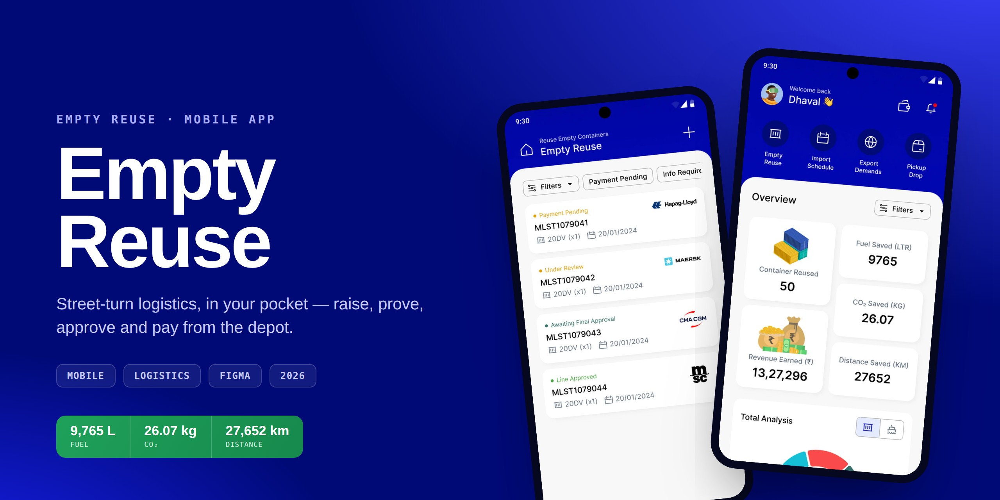

# Empty Reuse — Mobile App

> A native mobile app that puts the entire empty-container **street-turn** workflow
> in one thumb's reach — raise a reuse request, upload container photos for review,
> track shipping-line approval, and settle payment, all from the depot instead of a desk.

  
  
  

| | |
| :--- | :--- |
| **Role** | Product Designer (research → flows → UI → design system) |
| **Surface** | Native mobile · ~40 screens |
| **Domain** | Container logistics · empty reuse / street turns |
| **Tools** | Figma |
| **Year** | 2026 |

---

## Contents

- [Overview](#overview)
- [The problem](#the-problem)
- [Goals](#goals)
- [Approach](#approach)
- [The solution](#the-solution)
  - [1 · Dashboard — open on the impact](#1--dashboard--open-on-the-impact)
  - [2 · The reuse loop — list & detail](#2--the-reuse-loop--list--detail)
  - [3 · Raising a request — a four-step flow](#3--raising-a-request--a-four-step-flow)
  - [4 · Payment — pay & done](#4--payment--pay--done)
  - [5 · States, sheets & edge cases](#5--states-sheets--edge-cases)
- [Design system](#design-system)
- [Key decisions](#key-decisions)
- [What the app delivers](#what-the-app-delivers)
- [Links](#links)

---

## Overview

In container logistics, an **empty reuse** (or *street turn*) is when an empty
container coming off one job is reused for the next export instead of being
trucked back to the depot empty. Every successful reuse saves a wasted trip —
real fuel, carbon and money.

The catch: these decisions happen **in yards and on the road**, not at a
workstation. The people who raise and pay for reuse requests are mobile, and the
existing process lived across phone calls, paperwork and a desktop tool none of
them had in hand at the moment of action. This project is the **mobile app** that
brings the whole loop into one place, designed for one-handed use in the field.

## The problem

Talking through the workflow surfaced a few clear pain points:

- **No single source of truth on the move.** Coordinators couldn't see, on their
  phone, what stage each request was at — submitted, under review, approved, or
  awaiting payment.
- **Container condition was hard to prove.** Reuse depends on a container being in
  acceptable condition; that evidence (photos) had to be captured and attached
  where the container actually was.
- **Approval was a black box.** Requests pass an ML photo review and then a
  shipping-line approval — but the requester had no visibility into where their
  request sat in that chain.
- **Payment was disconnected.** The street-turn charge (plus GST) was settled
  separately from the request, adding friction and delay.
- **The value was invisible.** The savings each reuse generated — fuel, CO₂,
  distance, revenue — were never surfaced back to the people doing the work.

## Goals

1. Put the **entire loop** — raise → prove → approve → pay → done — on a phone.
2. Make **status legible at a glance** across a whole list of requests.
3. Make capturing **container photos** a first-class, in-flow step.
4. Connect **payment** directly to the request, itemised and transparent.
5. **Prove the impact** by leading with sustainability and revenue metrics.

## Approach

I designed the app outward from its two anchor moments:

- **The dashboard**, which had to answer *"is this worth it?"* in one screen, and
- **The request detail**, which had to answer *"where is this, and what do I do next?"*

Everything else — the list, the four-step create flow, the payment sheets, the
edits and confirmations — was shaped to feed those two anchors. I kept the
information architecture shallow (a bottom-tab home, a filterable list, a tabbed
detail) so a field user is never more than a tap or two from an answer, and I
reserved a single accent colour for *sustainability* so the app's core promise
stays visually consistent from the dashboard down to a single approved request.

## The solution

### 1 · Dashboard — open on the impact

The home screen leads with **proof**, not navigation. Five tiles sit up top:
containers reused and revenue earned (the business case) beside fuel, CO₂ and
distance saved (the sustainability case). Below them, a **Total Analysis donut**
breaks the entire portfolio of 200 containers into its five statuses at a glance,
and a **reuse-by-city** list shows where activity is concentrated (Pune, Nashik,
Vasai, Panvel, Morbi). Quick actions (Empty Reuse, Import Schedule, Export
Demands, Pickup/Drop) and a Filters sheet round it out.

> **Why:** putting numbers first makes the app feel like a results tool, not a
> data-entry form — it earns the scroll before it asks for anything.

### 2 · The reuse loop — list & detail

The **Empty Reuse list** shows every request as a card carrying its shipping line
(Hapag-Lloyd, Maersk, CMA CGM, MSC), container type, date, and a single
colour-coded **status** — Payment Pending, Under Review, Awaiting Final Approval,
Line Approved, Line Rejected. Filter chips and a full filter sheet (line, port,
date range, container number, type/size) make a long list triage-able in a tap.

Open a request and the **detail** leads with that trip's *projected savings*
strip, then the import/export DO pair with addresses, then three tabs:

- **Containers** — container cards with condition photos and an *Add container* action.
- **Payments** — what was charged and how it was paid.
- **Timeline** — the request's history: *submitted → moved to info required → photos re-uploaded → pending with ML review.*

> **Why three tabs:** the detail holds three different jobs (the cargo, the money,
> the history). Splitting them keeps each screen scannable instead of one endless
> scroll.

### 3 · Raising a request — a four-step flow

Creating a reuse is broken into **four small steps** with a progress bar rather
than one intimidating form:

1. **General** — shipping line, port/ICD, empty-reuse date.
2. **Route** — import/export DO details and factory addresses.
3. **Containers** — type/size and container numbers.
4. **Review & photos** — upload container condition photos, then submit.

Each step is a self-contained sheet with Previous/Next, so a coordinator can
complete it one-handed without losing their place. Editing an existing request
reuses the exact same shapes, and a clear success state confirms the request was
created.

### 4 · Payment — pay & done

Payment is **itemised per container** — street-turn charge plus 18% GST — so the
requester sees exactly what each box costs. They can apply a **credit balance**,
**generate a payment link** to pass on, or pay directly. Both **saved card** and
**UPI** are first-class methods, and a **Payment Successful** screen closes the
loop. This connects the operational request to its money in the same flow,
instead of a separate system.

### 5 · States, sheets & edge cases

Beyond the happy path, the app handles the real-world middles and ends:

- **Filters** for both the dashboard and the reuse list.
- **Row actions** — edit, cancel, or pay now — from a quick sheet.
- **Guarded confirmations** for destructive actions (cancel/delete), and clear
  **success** acknowledgements.
- **Add / edit container** with photo upload, reused across create and detail.

## Design system

**Colour.** A single saturated **electric-blue scale** (`#f0f3ff` → `#000a77`,
primary `~#1319ff`) carries the product, with a **reserved green** used *only* for
sustainability and progress — savings, approvals, completed steps. Status is never
just text; each request status maps to a consistent colour so a list can be
scanned at a glance.

**Type.** A clean geometric sans for UI, with a monospaced face for the data that
needs to read precisely — request IDs (`MLST1079041`), container numbers
(`MEDU1234561`) and amounts (`₹9,440`).

**Components & patterns.**
- **Savings strip** — the recurring green Fuel / CO₂ / Distance module.
- **Status donut** — the whole portfolio in one ring.
- **Stepped form** — the 4-step, progress-barred create/edit flow.
- **Tabbed detail** — Containers · Payments · Timeline.
- **Bottom sheets** — filters, payment method, and row actions.

## Key decisions

- **Lead with outcomes.** The dashboard opens on saved fuel, carbon and revenue —
  reframing a logistics utility as a results tool.
- **One reserved accent.** Green means "good for the planet / good to go"
  everywhere, so the sustainability story never gets diluted.
- **Status as colour, always.** Five request states, five consistent colours, so
  triage happens with the eye, not by reading.
- **Split the create flow.** Four small steps beat one long form for one-handed,
  in-the-field completion.
- **Money in the same loop.** Itemised, container-wise charges live with the
  request rather than in a separate tool.

## What the app delivers

- A single mobile home for the full empty-reuse workflow.
- At-a-glance proof of value — financial *and* environmental.
- A fast, photo-first way to raise and approve reuse requests.
- Transparent, itemised payment that closes the loop in-app.

## Links

- **▶ Live, interactive case study:** https://dhaval-sukharamwala.github.io/empty-reuse-mobile-case-study/
- **Behance:** https://www.behance.net/your-handle

---

Designed by Dhaval Sukharamwala · Product Design · 2026
